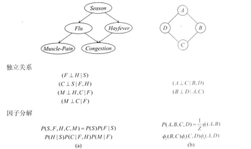

[Overview and Motivation](probabilistic_graphical_models/1.1.1-Intro-overview.pdf) Chapter 1.

#### Overview and Motivation

Q. PGM  what

A.  1. 利用复杂分布中的结构来紧凑表示它们

2. 使模型能够有效构造和利用

  Q. PGM how

  A. 1. 使用基于图表示来紧凑编码复杂分布在高维中的

  2. 

  Q. 图作为独立关系集合 VS 图作为分解分布的框架等价

  A. 1. 独立性允许在图紧凑表示分解形式

  2. 分布的特殊的分解形式保证了独立特性

  Q. 图表示的两大家族

  A. 1. Bayesian 有向图

  2. Markov network 无向图

Q. PGM表示 优点

A. 1. 允许分布写的有迹可循 --> 不透明模型导致无法解释，甚至不希望的答案

2. 同样的结构允许分布被使用有效的对于推断
3. 有助于这些模型的有效构造
   * 通过从数据中学习模型良好近似我们过去的经验
   * 数据驱动的模型，人类专家提供给定阈内指导

Q. 表示、推断和学习是智能系统最重要的几个组件

A. 1. 陈述描述是我们世界的合理的编码

2. 使用这个表示有效回答广泛感谢趣的问题
3. 需要这些分布，组合专家知识和积累的数据
4. PGM是小的模型支持这三个特性在广泛的问题上

