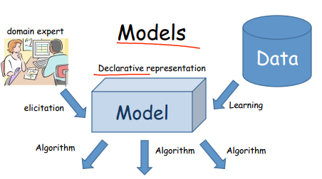
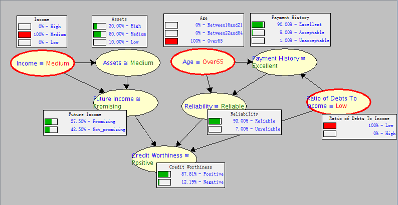

* 模型的表示其来源可以由相应领域的专家给出，也可以直接从数据中学习到。如下所示：

* 模型的准确性具有不确定性主要是因为：对现实世界的描述不全面；观察到的数据有噪声；模型只是体现大部分的数据，对某些特例不会考虑；模型固有的不确定性。
* PGM模型在实际使用时需要考虑以下几个方面：
  * 表达阶段：有图模型还是无图模型，时序模型还是平面模型。
  * 推理阶段：近似推理还是确定推理，是否需要做出决定。
  * 学习阶段：是学习网络的参数还是连结构也需要学习，是否使用全部数据。
* 一个factor其实就是一个因果表，因果表中变量组成的集合称为scope。两个factor是可以相乘的，称为factor product. Factor也可以边缘化，即把表中边缘变量给求和积分掉。另外还可以从factor中提取出部分行，这种操作称为factor reduction。还可以根据新获得的evidence来更改factor的概率值。
* 在PGM模型中使用factor的原因是：在高维空间的数据分布中，factor是一个基本的模块。这些高维空间中的大数据也可以由小的factor相乘组成，并且一些基本的操作都是相通的。

### 编程作业：

* 这次实验是熟悉下SamIam这个软件，该软件是专门正对PGM的实际应用开发的，具体介绍和使用参考官网：<http://reasoning.cs.ucla.edu/samiam/index.php>。首先第一个小题就是构造一个贝叶斯网络图，节点已经给出，并且父子关系已经给出了文字描述，只需连线和给出条件概率表值。网络图如下所示：

* [机器学习&数据挖掘笔记_17（PGM练习一：贝叶斯网络基本操作](http://www.cnblogs.com/tornadomeet/archive/2013/05/12/3074329.html)

### 1.1 动机

- 本书主要关注涉及不确定性的复杂系统模型；
- 为了得到有意义的结论，我们不仅不要推理什么是可能的，而且需要推理什么是很可能的

### 1.2.1 概率图模型

- 图定义了紧凑表示高维分布的一种框架；
- 与其对问题中所有变量的可能取值的概率进行编码，不如将分布分解为一些更小的因子，使每个因子定义在一个更小的概率空间；
- 结果是这两种视角——图作为独立关系集合的表示与图作为分解分布的框架——在深层意义上是等价的
- 准确说，正是分布的独立特性才使得分布能够紧凑地以因子分解的形式表示。反之，分布的一个特别的因子分解确保了某些独立关系的成立，

### 1.2.2 表示、推理、学习

- 图模型优点
  1. 分布通常可以用便于处理的方式描述，甚至在联合分布的显式表示如天文数字般庞大的情况下也是如此，重要的是，由此框架提供的这类表示是透明的，因而专家可以理解并评估其语义和性质，对于构建一个准确的反映我们队问题理解的模型而言，这个性质是重要的，不透明的模型容易导致无法解释的，甚至不希望的答案；
  2. 如我们所表明的，相同的结构常常可以使分布有效地应用于推理中——把分布作为关于世界的模型来回答查询；
  3. 有助于这些模型的有效构造，无论是通过专家还是自动地，利用数据学习，一个模型能够提供对于我们过去经验的很好的额近似，

## 课程资料

#### introduction and overview

[Overview and Motivation](probabilistic_graphical_models/1.1.1-Intro-overview.pdf) Chapter 1.

[Distributions](probabilistic_graphical_models/1.1.2-Intro-distributions.pdf) Chapters 2.1.1 to 2.1.3.

[Factors](probabilistic_graphical_models/1.1.3-Intro-factors.pdf). Chapter 4.2.1.

### Bayesian Network Fundamentals

[[Semantics and Factorization](probabilistic_graphical_models/2.1.1-Repn-BNs-semantics.pdf) Chapters 3.2.1, 3.2.2. 

[Reasoning Patterns](probabilistic_graphical_models/2.1.2-Repn-BNs-patterns.pdf). Chapter 3.2.1.

[Flow of Probabilistic Influence](probabilistic_graphical_models/2.1.3-Repn-BNs-flow-influence.pdf). Chapter 3.3.1.

### Bayesian Networks: Independencies

[Conditional Independence](probabilistic_graphical_models/2.1.4-Repn-Ind-conditional-independence.pdf). Chapters 2.1.4, 3.1.

[Independencies in Bayesian Networks](probabilistic_graphical_models/2.1.5-Repn-Ind-BNs.pdf). Chapter 3.2.2.

[Naive Bayes](probabilistic_graphical_models/2.1.6-Repn-BNs-NaiveBayes.pdf). Chapter 3.1.3.

### Bayesian Networks: Knowledge Engineering

[Application - Medical Diagnosis](probabilistic_graphical_models/2.1.7-Repn-BNs-diagnosis.pdf) Chapter 3.2: Box 3.D (p. 67).