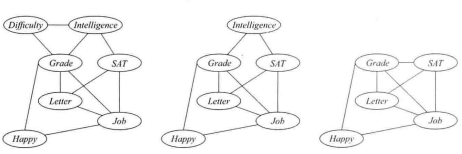
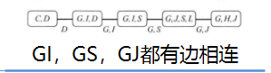
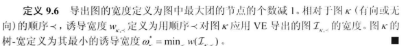

[Variable Elimination Complexity](probabilistic_graphical_models/3.2.2-Inf-VE-complexity.pdf). Chapter 9.4 through 9.4.2.3.

### Variable Elimination Complexity

Q. Variable Elimination Complexity-Variable Elimination 优势
A. 

1、比全部联合分布枚举计算更有效率

2、更好的表现

Q. Variable Elimination Complexity-消除步骤

A. 	

1、选择一个变量Xi

2、将所有涉及该变量的因子相乘得到 vi

3、所有vi求和得到新的因子

Q. Variable Elimination Complexity-消除先后图的变化

A. 

1、	和已经消除的变量相关的边消失
2、	由于消除操作添加了一些信息边

3、 	

Q. Variable Elimination Complexity-导出图

A. 	

1、在原来变量因子集中以一定消除顺序消除的无向图，

2、其中如果xi和xj同时出现在VE算法以消除顺序产生的中间因子中，则他们有一条边 

Q. Variable Elimination Complexity-最大因子 VS 导出图最大团

A. 	

1、我们算法生成的最大因子和导出图的最大团之间有直接的依赖关系

2、导出图和最大团大小在消除顺序上有强依赖关系

Q. Variable Elimination Complexity-导出图的宽和树的宽

A. 	

1、在图中最大团中节点数目-1

2、
