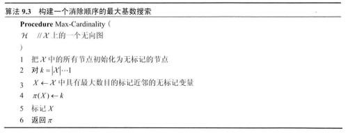

[Finding Elimination Orderings](probabilistic_graphical_models/3.2.4-Inf-VE-elimorder.pdf). Chapter 9.4.3.

### Finding Elimination Orderings

Q. Finding Elimination Orderings-要解决问题

A.

1、我们如何计算图的最小诱导宽度，
2、以及消除顺序如何达到那个宽度呢？

Q. Finding Elimination Orderings-如何寻找最优消除顺序
A. 

1、使用导出图的一个重要的图论性质
2、使用启发式的思想

Q. Finding Elimination Orderings-什么是玄图

A. 

每个最小循环的环都是3个节点的无向图

Q. Finding Elimination Orderings-玄图 V.S. 导出图
A.

1、每个导出图都是玄的
2、任何玄图H都允许有不引入任何填充边的消除顺序

Q. Finding Elimination Orderings-Max-Cardinality 算法
A.

1. 构建消除顺序的时候在玄图中不引入任何填充边
2.  特点
   * 没有使用团树作为开始点，而是直接操作图
   * 消除顺序每次消除一个团
   * 开始与图树的叶节点
   * 没有显示考虑图树的结构

3. 处理非玄图
   * 可以使用来构造消除顺序
   * 产生的顺序不如用其他算法好

Q. Finding Elimination Orderings-最小填充/规模/加权搜索

A.

​	目标
​		构建一个导出小的图的顺序
​	特点
​		每次通过贪心的方式消除变量
​		每一步都导致一个小的规模图
​	损失
​		最少近邻
​			在当前图中拥有的近邻的数目
​		最小权重
​			近邻的权重的乘积
​		最小填充
​			由于消除这个顶点而需要添加到图中的边的数目
​		加权最小填充
​			由于消除这个顶点而需要添加的边的权重的和
​	贪心查找有哪些
​		确定性的
​			每一步选择一些数目的分数低的节点，在这里面选择分数最低的
​		随机的
​			多次迭代算法，选择导致最有效消除的顺序
​				产生的因子的规模的总数和最小的顺序	
